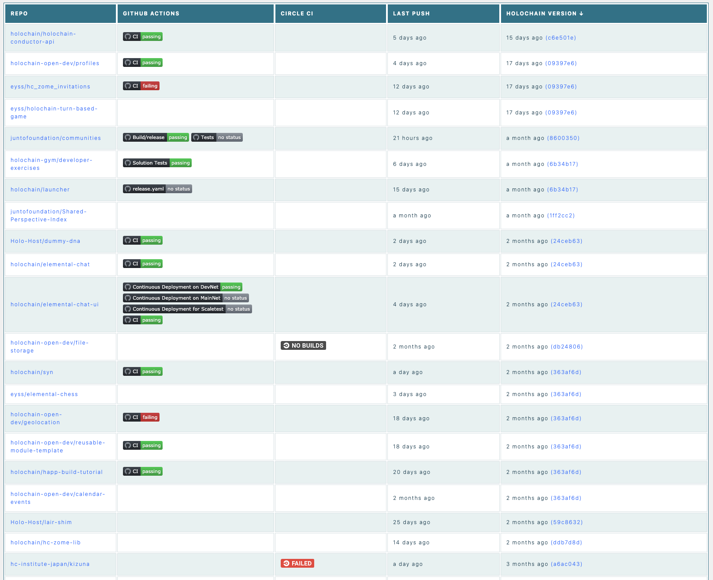

# Holochain CI Matrix



Aggregates Continuous Integration information from multiple repos across multiple orgs. Provides a single unified view of health of related projects.

## Project management

See: https://github.com/orgs/holochain-ci/projects/1

## Development

Built with Sveltekit.

### Start a local server

```
cp .env.example .env
```

Edit these values as desired. To increase Github API limits (from 60/hour to 5000/hour as of this writing), create a Github token and add it to `.env`.

Then:

```
yarn install
yarn dev
```

Your local instance should be running on http://localhost:7777

### Create a production build locally

```
yarn build
yarn preview
```

Your local instance should be running on http://localhost:8888
